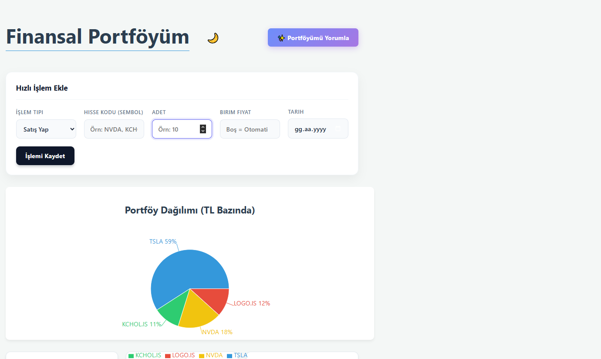
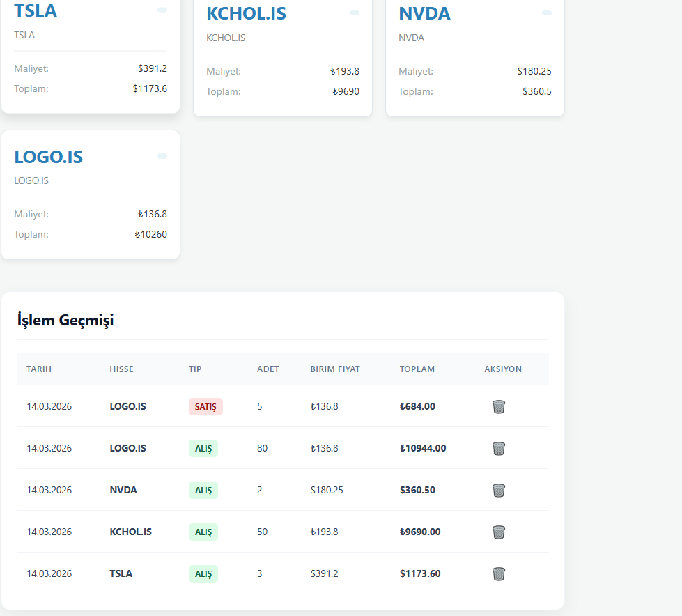
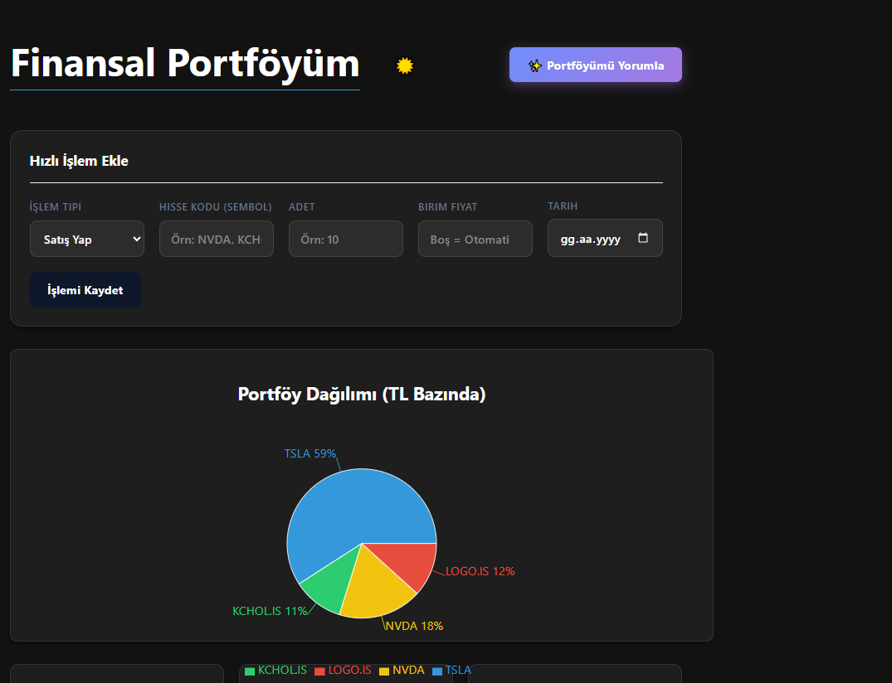
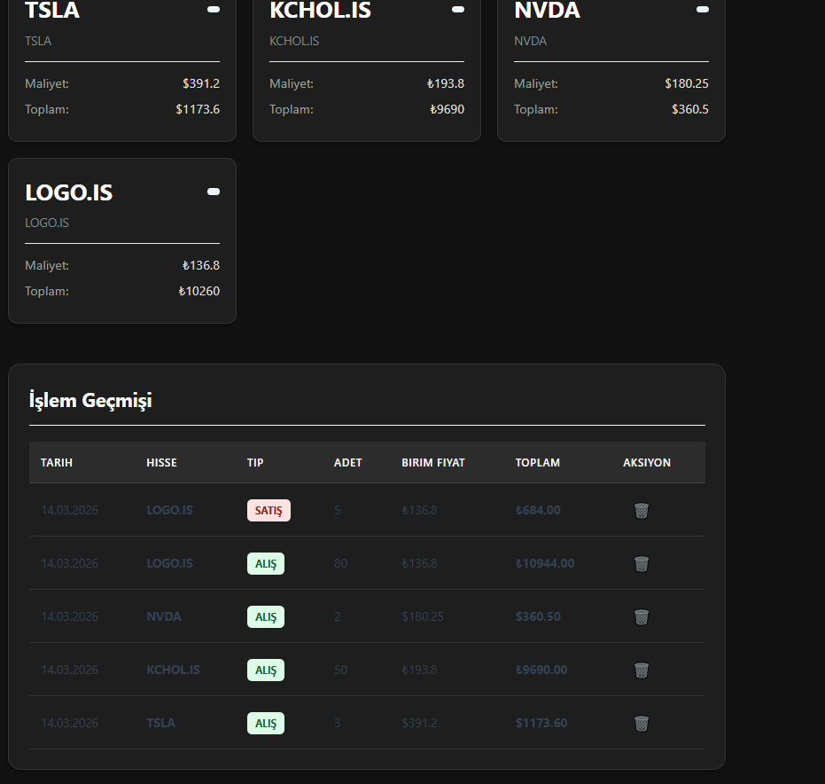

# Global Portfolio Manager (Multi-Currency Finance App)

Bu proje, farklı küresel borsalardaki (BIST, NASDAQ,vb.) yatırımları tek bir ekrandan takip etmeyi sağlayan, çoklu para birimi (Multi-Currency) destekli bir Full-Stack finansal portföy yönetim sistemidir. 

Kullanıcıların hem Dolar ($) hem de Türk Lirası (₺) bazlı varlıklarını anlık kur üzerinden hesaplayarak tek bir ana para biriminde görselleştirir.

## Özellikler (Features)

* **Canlı Veri Entegrasyonu:** Yahoo Finance API üzerinden hisse senetlerinin ve fonların anlık fiyatları çekilir.
* **Çoklu Para Birimi (Multi-Currency):** Amerikan hisseleri (örn: TSLA) USD bazında, Türk hisseleri (örn: KCHOL.IS) TRY bazında kaydedilir. 
* **Gerçek Zamanlı Kur Çevirisi:** Arka uçta `USDTRY=X` paritesi canlı olarak çekilir ve portföy ağırlıkları hesaplanırken tüm varlıklar matematiksel olarak eşitlenir.
* **Veri Görselleştirme:** Recharts kütüphanesi kullanılarak yatırımların TL bazındaki anlık değerlerine göre dinamik bir Pasta Grafiği (Pie Chart) sunulur.
* **Dark/Light Mode:** Göz yormayan, modern ve duyarlı (responsive) kullanıcı arayüzü.

## Kullanılan Teknolojiler (Tech Stack)

**Frontend:**
* React.js (Vite)
* Recharts (Veri Görselleştirme)
* CSS3 & CSS Variables (Tema Yönetimi)

**Backend:**
* C# & ASP.NET Core 
* Entity Framework Core (ORM)
* Yahoo Finance v8 Chart API (Finansal Veri Sağlayıcı)

## Karşılaşılan Zorluklar ve Mühendislik Çözümleri (Challenges & Solutions)

Proje geliştirme sürecinde karşılaşılan en büyük zorluk, standart finansal API'lerin (örn: Finnhub) ücretsiz planlarındaki **Rate-Limit (429)** ve Türkiye piyasası (.IS) için verdiği **Yetkilendirme (401 Unauthorized)** hatalarıydı.

**Çözüm:** Standart API uç noktaları yerine, Yahoo'nun doğrudan grafik çizdirmek için kullandığı düşük gecikmeli **v8 Chart API** altyapısına tersine mühendislik (reverse-engineering) ile erişildi. Unix Timestamp (Zaman Damgası) dönüşümleri yapılarak hem anlık fiyatlar hem de geçmiş tarihli (`GetHistoricalPriceAsync`) maliyet fiyatları pürüzsüz ve limitsiz bir şekilde sisteme entegre edildi.

## Ekran Görüntüleri

---
*Bu proje, finansal verilerin yönetimi ve farklı mimarilerin (Frontend - Backend - External API) birbirleriyle nasıl asenkron ve hatasız haberleştiğini deneyimlemek amacıyla geliştirilmiştir.*
